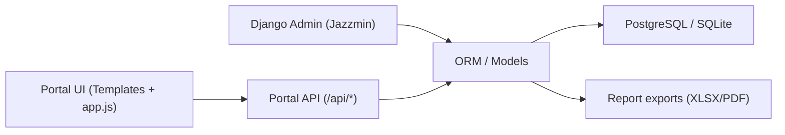

# Документация проекта Mirabad Avenue / HydroFlow

## 1. Назначение проекта
Проект — это Django-система для управления жилым сектором (`Mirabad Avenue`) с двумя основными контурами:
- операционный веб-портал (кастомный frontend на шаблонах + JS/CSS),
- административная панель Django (Jazzmin) и backend-API для операций по жильцам, платежам, уведомлениям, техобслуживанию и экспортам.

Система объединяет:
- учет структуры недвижимости (комплекс → дом → квартира → владелец),
- биллинг (отопление/ГВС, начисления, перерасчеты),
- транзакции и баланс жильцов,
- поддержку эксплуатационных процессов (алерты, maintenance, аудит, чеклисты, support).

---

## 2. Технологический стек

### 2.1 Backend
- Python + Django `>=5,<6`
- Django REST Framework `3.17.1`
- `drf-spectacular` (OpenAPI schema + Swagger UI)
- `django-jazzmin` (оформление admin)
- `django-cors-headers`
- `psycopg2` (PostgreSQL)
- `python-dotenv` (загрузка `.env`)
- `openpyxl` (XLSX-экспорты)
- `reportlab` (PDF-экспорты)

### 2.2 Frontend
- Django Templates
- Tailwind через CDN
- Chart.js через CDN
- Кастомный `static/js/app.js` и `static/css/app.css`
- Кастомный admin JS/CSS (`admin_custom.js`, `admin_custom.css`)

### 2.3 БД
- Основной сценарий: PostgreSQL через env-переменные.
- Fallback: SQLite (`db.sqlite3`) при отсутствии `DB_ENGINE`.

---

## 3. Архитектура (высокий уровень)

Ключевая идея:
- единый источник данных — Django модели,
- frontend получает агрегированную структуру через `api/portal-data` и специализированные list/action endpoints,
- изменения из портала пишутся в реальные модели + фиксируются в `AuditEvent`.

---

## 4. Структура репозитория

Корневые каталоги:
- `config/` — настройки проекта, root URLs, Jazzmin конфиг.
- `main_app/` — базовая доменная модель недвижимости и жильцов.
- `properties/` — proxy-модели для совместимости/переиспользования.
- `billing/` — расчетный контур и legacy-совместимость биллинга.
- `payments/` — транзакции и интеграционный слой Payme.
- `portal/` — операционная модель, backend-агрегация, API и экспорты.
- `templates/` — layout, страницы, body-шаблоны и overlays.
- `static/` — frontend assets (JS/CSS, изображения).

Служебные файлы:
- `manage.py`
- `requirements.txt`
- `.env.example`
- `.gitignore`
- `schema_tmp.yml` и файл `-` (дубликат OpenAPI-снимка).

---

## 5. Конфигурация и запуск

### 5.1 Переменные окружения
Пример в `.env.example`:
- `SECRET_KEY`
- `DEBUG`
- `ALLOWED_HOSTS`
- `DB_ENGINE`, `DB_NAME`, `DB_HOST`, `DB_PORT`, `DB_USER`, `DB_PASSWORD`
- `CORS_ALLOW_ALL_ORIGINS`, `CORS_ALLOWED_ORIGINS`, `CORS_ALLOW_CREDENTIALS`

Важно:
- в текущем рабочем `.env` есть реальные секреты/пароли — их нельзя публиковать.

### 5.2 Загрузка env
`config/settings.py`:
- сначала грузит `BASE_DIR/.env`,
- если `DB_ENGINE` не задан, пытается подхватить внешний `.env` из соседнего проекта (`Mirabad_Avenue/mirabad_avenue/.env`).

### 5.3 База данных
- Если `DB_ENGINE` truthy: используется внешняя БД (обычно PostgreSQL).
- Иначе: SQLite.

### 5.4 Статические и медиа
- `STATIC_URL = /static/`
- `STATICFILES_DIRS = [BASE_DIR/static]`
- `STATIC_ROOT = BASE_DIR/static_collected`
- `MEDIA_URL = /media/`
- `MEDIA_ROOT = BASE_DIR/media`

### 5.5 Запуск (Windows)
1. `python -m venv venv`
2. `venv\Scripts\activate`
3. `pip install -r requirements.txt`
4. `python manage.py migrate`
5. `python manage.py createsuperuser`
6. `python manage.py runserver`

---

## 6. URL-карта проекта

Root (`config/urls.py`):
- `/api/schema/` — OpenAPI schema.
- `/api/docs/` — Swagger UI.
- `/admin/main_app/sector/` — редирект на единый сектор.
- `/admin/` — Django admin.
- `/main-app/` — подключен, но в `main_app/urls.py` маршрутов нет.
- `/backend-billing/` — подключен, но в `billing/urls.py` маршрутов нет.
- `/backend-payments/` — подключен, но в `payments/urls.py` маршрутов нет.
- `/` — `portal.urls` (основной пользовательский интерфейс + API).

Portal page routes:
- `/` dashboard
- `/residential/`
- `/system-health/`
- `/billing/`
- `/billing/periods/create`
- `/analytics/`

---

## 7. Доменная модель (ORM)

## 7.1 `main_app` (базовая структура)

### `Complex`
Поля: `title`, `address`, `created_at`, `author`.
Особенность: `save()` принудительно задает `address = "Mirabad Avenue"`.

### `Building`
Поля: `number`, `address`, `complex(FK)`, `created_at`, `author`.

### `BuildingSection`
Поля: `building(FK)`, `name`; `unique_together(building, name)`.

### `Apartment`
Поля: `number`, `area`, `building(FK)`, `section(FK nullable)`, `created_at`, `author`.

### `Owner`
Поля: `fio`, `phone`, `apartment(OneToOne)`, `balance`, `has_contract`,
`telegram_id`, `telegram_status`, `telegram_user`, `created_at`.

Баланс:
- `> 0` — переплата,
- `< 0` — задолженность.

## 7.2 `properties` (proxy слой)
Proxy-модели (`Complex`, `Building`, `BuildingSection`, `Apartment`, `Owner`) над `main_app`.
Назначение: совместимость и альтернативные verbose names без дублирования таблиц.

## 7.3 `billing` (core + legacy совместимость)

### Core-модели
- `BillingPeriod`
- `BuildingService`
- `ServiceExpense`
- `HeatingApartmentUsage`
- `HotWaterReading`
- `Charge`
- `Payment`
- `RecalculationLog`

### Legacy-совместимость
- `Expense`
- `GasMeterReading`
- `HeatingRecord`
- `HotWaterMeterReading`
- `Invoice`
- `HeatingCalculationSummary`
- `HotWaterCalculationSummary`

### Логика ядра
`BillingPeriod` содержит методы:
- `close_period()` — рассчитывает тарифы, формирует `Charge`, уменьшает баланс жильцов.
- `reopen_period()` — переводит закрытый период в reopened.
- `recalculate(reason, author)` — отменяет старые начисления, создает новые, применяет delta к балансам, пишет `RecalculationLog`.

`BuildingService.calculate()`:
- полная валидация,
- `total_expense` (expense items + газ, если задан),
- `total_volume` (по heated area или consumption),
- `tariff = total_expense / total_volume`,
- проставляет `is_calculated`, `calculated_at`.

`Payment.apply()` (billing.Payment):
- атомарно добавляет сумму к `Owner.balance`,
- защищает от повторного применения (`is_applied`).

## 7.4 `payments`

### `Transaction`
Единый журнал движений баланса:
- `payment_type` (`payme`, `click`, `cash`, `manual`, `charge`)
- `amount` (может быть +/-)
- `balance_before`, `balance_after`
- `external_id` (уникальный)
- `invoice(FK optional)`, `owner(FK)`

### `PaymeTransaction`
Хранение callback/технических данных Payme.

## 7.5 `portal` (операционный слой)

Модели:
- `WorkspaceProfile`
- `PortalNotification`
- `SystemAlert`
- `MaintenanceTask`
- `ChecklistItem`
- `ChecklistNote`
- `AuditEvent`
- `PortalStatusOverride`
- `SupportTicket`
- `TelemetryNode`
- `TelemetrySample`

Назначение:
- operational UX (алерты, support, чеклисты, maintenance),
- аудит пользовательских действий,
- UI-override статусов таблиц без изменения core-моделей.

---

## 8. Миграции и эволюция схемы

Количество миграций по приложениям:
- `main_app`: 5 (последняя `0005_consolidate_single_sector`)
- `billing`: 3 (последняя `0003_backfill_billing_core`)
- `payments`: 1
- `portal`: 4
- `properties`: 1

Критичные миграции:
- `main_app 0005`: консолидация всех комплексов в единый сектор `Mirabad Avenue`.
- `billing 0003`: backfill данных из legacy-таблиц в новый billing-core слой.

---

## 9. API портала

Все backend API маршруты находятся в `portal/urls.py`.

## 9.1 Сервисные GET endpoints
- `GET /api/` — root API links.
- `GET /api/health/` — healthcheck `{status: ok}`.
- `GET /api/portal-data/` — полный snapshot данных для UI.

## 9.2 List endpoints (GET, с пагинацией)
Формат ответа list endpoint:
- `results`, `page`, `page_size`, `total`, `pages`, `ordering`.

### `GET /api/lists/residents/`
Фильтры:
- `status`, `telegram`, `contract`, `owner_id`, `name`, `phone`, `telegram_user`,
`building`, `apartment`, `district`, `period`, `period_from`, `period_to`,
`complex_id`, `building_id`, `apartment_id`, `ordering`.

### `GET /api/lists/transactions/`
Фильтры:
- `search`, `status`, `payment_type`, `district`, `period`, `period_from`, `period_to`,
`owner_id`, `complex_id`, `building_id`, `apartment_id`, `ordering`.

### `GET /api/lists/maintenance/`
Фильтры:
- `search`, `status`, `priority`, `district`, `period`, `period_from`, `period_to`,
`complex_id`, `building_id`, `ordering`.

### `GET /api/lists/alerts/`
Фильтры:
- `search`, `severity`, `status`, `pinned`, `district`, `period`, `period_from`, `period_to`, `ordering`.

### `GET /api/lists/audit/`
Фильтры:
- `search`, `type`, `actor`, `district`, `period`, `period_from`, `period_to`,
`complex_id`, `owner_id`, `ordering`.

### `GET /api/lists/complexes/`
Фильтры:
- `search`, `debt_status`, `district`, `ordering`.

## 9.3 Action endpoints (POST)

### Audit/checklist/support/session
- `POST /api/audit/note/` — добавить `AuditEvent`.
- `POST /api/checklist/note/` — create/toggle checklist note.
- `POST /api/support/ticket/` — создать `SupportTicket` + `AuditEvent`.
- `POST /api/logout/` — logout + `redirectUrl`.

### CRUD из портала
- `POST /api/complexes/create/` — **disabled** (возвращает 410, single-sector политика).
- `POST /api/buildings/create/` — создать дом.
- `POST /api/apartments/create/` — создать квартиру.
- `POST /api/residents/create/` — создать жильца (owner) для квартиры.
- `POST /api/payments/create/` — создать транзакцию и обновить баланс owner.

### Resident tools
- `POST /api/resident-kit/action/` — три действия:
  - `move_in_checklist`
  - `reminder_script`
  - `contact_sheet`

### Maintenance / alerts / statuses
- `POST /api/maintenance/deploy/` — создать `MaintenanceTask`.
- `POST /api/system-alerts/configure/` — create/acknowledge/resolve системных алертов + sync с `PortalNotification`.
- `POST /api/technicians/assign/` — назначить техника (maintenance/alert/notification/resident fallback).
- `POST /api/status/assign/` — статусы для residential/transactions/maintenance.

### Экспорт и напоминания
- `POST /api/usage-report/export/` — фиксирует событие экспорта usage report.
- `POST /api/export/report/` — универсальный экспорт (`XLSX`/`PDF`), в т.ч. специализированные billing report types.
- `POST /api/reminders/send/` — создать reminder-уведомления для целевых жильцов.

## 9.4 Период-фильтрация
`_apply_period_filter` поддерживает:
- custom range: `period_from` / `period_to`
- preset: `period=30`, `period=90`, `period=month`, `period=all`.

---

## 10. Контракт `portal-data`

Top-level ключи snapshot (`GET /api/portal-data/`):
- `source`, `generatedAt`, `profile`,
- `complexes`, `residents`, `transactions`,
- `notifications`, `systemAlerts`, `maintenanceTasks`,
- `auditEvents`, `checklistItems`, `checklistNotes`,
- `supportTickets`, `supportSummary`,
- `telemetryNodes`, `pressureSeries`.

Ключевые схемы строк:
- resident row: идентификаторы backend/slugs, контакты, баланс, telegram, contract.
- complex row: здания, юниты, риск, debt, collected, pressure/water агрегаты.
- transaction row: signed amount, payment type/method, before/after balances.
- maintenance row: priority/status/assigned/scheduled.

Источник данных для snapshot: `portal/backend_data.py` (`build_portal_data`).

---

## 11. Экспортный контур

Файлы:
- `portal/views.py` (общий export endpoint + fallback рендер),
- `portal/report_exports.py` (advanced backend reports).

Поддерживаемые report types (`report_exports.py`):
- `hot_water`
- `heating`
- `payments`
- `all`

Форматы:
- `XLSX` (openpyxl, многошитовые книги + стили),
- `PDF` (reportlab, таблицы и summary).

Фильтры в payload экспорта:
- `complex_backend_ids`
- `building_backend_ids`
- `apartment_backend_ids`
- `owner_ids`
- `transaction_backend_ids`
- `maintenance_backend_ids`
- `date_from`, `date_to`

---

## 12. Frontend архитектура

## 12.1 Шаблоны
- `templates/base.html` — основной layout, подключение Tailwind CDN, Chart.js, `app.css`, `app.js`, гидрация `window.HydroFlowBackendData`.
- `templates/partials/sidebar.html`, `topbar.html`.
- `templates/partials/app_overlays.html` — модалки/дроверы.
- Страницы: `dashboard`, `residential`, `billing`, `system_health`, `analytics`, `billing_period_create`.
- Body-фрагменты: `templates/portal/bodies/*.html`.

## 12.2 Оверлеи (54 id)
Ключевые группы:
- notifications/audit/support/checklist/profile/settings drawers,
- details/apartment details drawers,
- create/modification modals (`create-building`, `create-apartment`, `add-payment`, `system-alerts-config`, `deploy-maintenance`, `assign-status`, `export-preview`, `billing-notice`, `confirm`).

## 12.3 JS логика (`static/js/app.js`)
Крупный монолитный скрипт (~10k строк), включает:
- i18n словари (en/ru/uz),
- theme/lang state,
- таблицы (поиск, пагинация, сортировки, bulk-выбор),
- overlay orchestration,
- API-клиент для `/api/*`,
- рендер/rehydration из `portalData`,
- export/reminder/status workflows,
- maintenance/network map interactivity,
- telemetry/chart behaviors.

API пути, используемые frontend:
- `/api/portal-data/`
- `/api/lists/residents/`
- `/api/lists/transactions/`
- `/api/lists/maintenance/`
- `/api/lists/alerts/`
- `/api/lists/audit/`
- `/api/residents/create/`
- `/api/buildings/create/`
- `/api/apartments/create/`
- `/api/payments/create/`
- `/api/maintenance/deploy/`
- `/api/system-alerts/configure/`
- `/api/audit/note/`
- `/api/checklist/note/`
- `/api/support/ticket/`
- `/api/export/report/`
- `/api/reminders/send/`
- `/api/resident-kit/action/`
- `/api/status/assign/`
- `/api/logout/`

## 12.4 CSS
- `static/css/app.css` (~19k строк): темы, компоненты, анимации, responsive.
- CSS vars (`:root`): `--hf-primary`, `--hf-surface`, `--hf-panel`, `--hf-border`, и т.д.

---

## 13. Django Admin и Jazzmin

Кастомизация:
- `config/jazz_sett.py`: topmenu links, иконки моделей, theme, custom assets.
- `static/js/admin_custom.js`: языковой свитчер, theme toggle, автоперевод UI, фильтры owner/apartment, balance preview.
- `static/css/admin_custom.css`: визуальная полировка admin интерфейса.

Особые правила admin-домена:
- единый сектор (`Mirabad Avenue`) enforced через model/save, admin redirect и миграцию.
- часть сущностей в admin read-only по бизнес-смыслу (например, transaction history/invoices).

---

## 14. Тесты и качество

Наличие тестов:
- `billing/tests.py` — полноценный набор unit/integration сценариев core биллинга (15 тестов).
- `main_app/tests.py`, `payments/tests.py`, `portal/tests.py` — заглушки.

Проверка в текущем окружении:
- запуск `manage.py test billing` стартует миграции и доходит до import check,
- падает из-за отсутствующего пакета `openpyxl` в активном окружении (`ModuleNotFoundError`).

Вывод:
- ядро биллинга покрыто лучше остальных частей,
- frontend/API портала и admin workflows практически без автотестов.

---

## 15. Текущие ограничения и риски

1. Сильная монолитность frontend:
- `app.js` и `app.css` очень большие, низкая модульность.

2. Смешение демо-слоя и продакшен-логики в шаблонах:
- в body-шаблонах есть статические демонстрационные блоки, которые затем переопределяются runtime-данными.

3. Неполное тестовое покрытие:
- только billing покрыт системно.

4. Зависимость от env-конфигурации и внешних пакетов:
- для корректного тест/экспорт контура нужны установленные `openpyxl` и `reportlab`.

5. Схема single-sector:
- создание новых комплексов отключено на API уровне (`410`), что нужно учитывать в дальнейшем roadmap.

---

## 16. Рекомендации на следующий этап разработки

1. Разбить frontend-монолит:
- вынести API client, overlay manager, table layer, i18n и page-specific controllers в отдельные модули.

2. Закрыть тестовые пробелы:
- API тесты для `portal/views.py` (filters + actions + error cases),
- smoke tests для critical workflows: create resident/payment/maintenance, export/report.

3. Упорядочить контракты API:
- формализовать request/response схемы для action endpoints (сейчас OpenAPI в основном `additionalProperties`).

4. Секреты и конфигурация:
- вынести реальные секреты из рабочего `.env`, оставить только безопасный шаблон.

5. Документацию держать актуальной:
- обновлять этот документ при каждом изменении моделей, API и frontend контрактов.

---

## 17. Быстрая памятка по ключевым файлам

Backend:
- `config/settings.py`
- `config/urls.py`
- `main_app/models.py`
- `billing/models.py`
- `payments/models.py`
- `portal/models.py`
- `portal/views.py`
- `portal/backend_data.py`
- `portal/report_exports.py`

Frontend:
- `templates/base.html`
- `templates/partials/sidebar.html`
- `templates/partials/topbar.html`
- `templates/partials/app_overlays.html`
- `templates/portal/bodies/*.html`
- `static/js/app.js`
- `static/css/app.css`

Admin UX:
- `config/jazz_sett.py`
- `static/js/admin_custom.js`
- `static/css/admin_custom.css`

---

## 18. Статус документа
Документ собран по текущему состоянию кода в репозитории `D:\!!!project_mirabad` и отражает фактическую реализацию маршрутов, моделей и frontend-интеграций на момент анализа.
